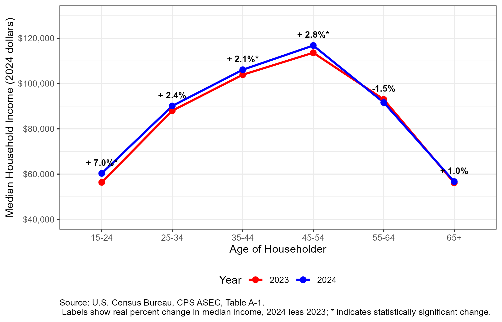

# Project Title

Write a 1-2 sentences that quickly and clearly convey what your repo is for.

## Overview

Expand on those introductory sentences with a brief but informative description of your project's purpose and goals. This section should help visitors decide whether they should dig deeper into your repo/project.

### Interesting Insight (Optional)

A second notable insight from the analysis is the inverted-U shape
of the household income–age curve. Median income climbs from around
$60,000 among 15-24-year-old householders to a peak of $116,800
among those aged 45-54, before dropping sharply at retirement. The
youngest age group also experienced the largest year-over-year real
income gain (+7.0%), suggesting that wage growth in 2024 was
concentrated among younger workers entering the labor market.

## Data Sources and Acknowledgements

Be sure to list where you got any data used within the project. Be sure to acknowledge any one whose work or elements you're drawing upon.

## Current Plan

Provide some information about what you intend to do with the project. You can additionally refer the visitor to your detailed plan document.

## Repo Structure

## Repo Structure

- `README.md` — this file; project overview and insights
- `report_ethan.qmd` —  Quarto source file for ethan's analysis
- `report_ethan.pdf` — rendered pdf for ethan's analysis. 
- `plan.md` — project plan in goal/needs/steps format
- `references.bib` — BibTeX bibliography for citations
- `apa7.csl` — citation style files
- `age_income_raw.csv` — age of householder data (Ethan)
- `age_income_chart.png` / `age_income_table.png` — exported visuals
- `Project_Guidelines.md` — course-provided rubric
- `.gitignore` / `.lintr` — version control and code-style configs

## Authors

Give information about who are the authors of the project and how people can get in touch if they have questions.
